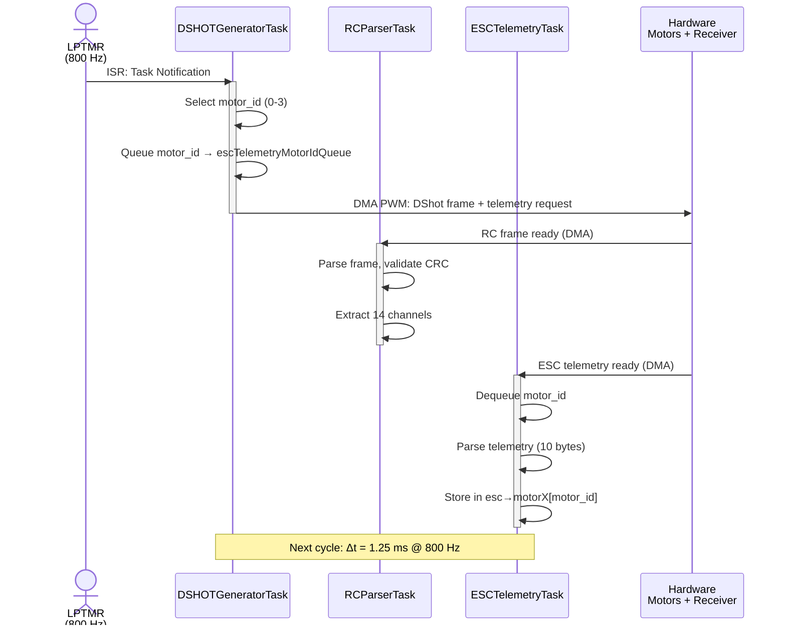
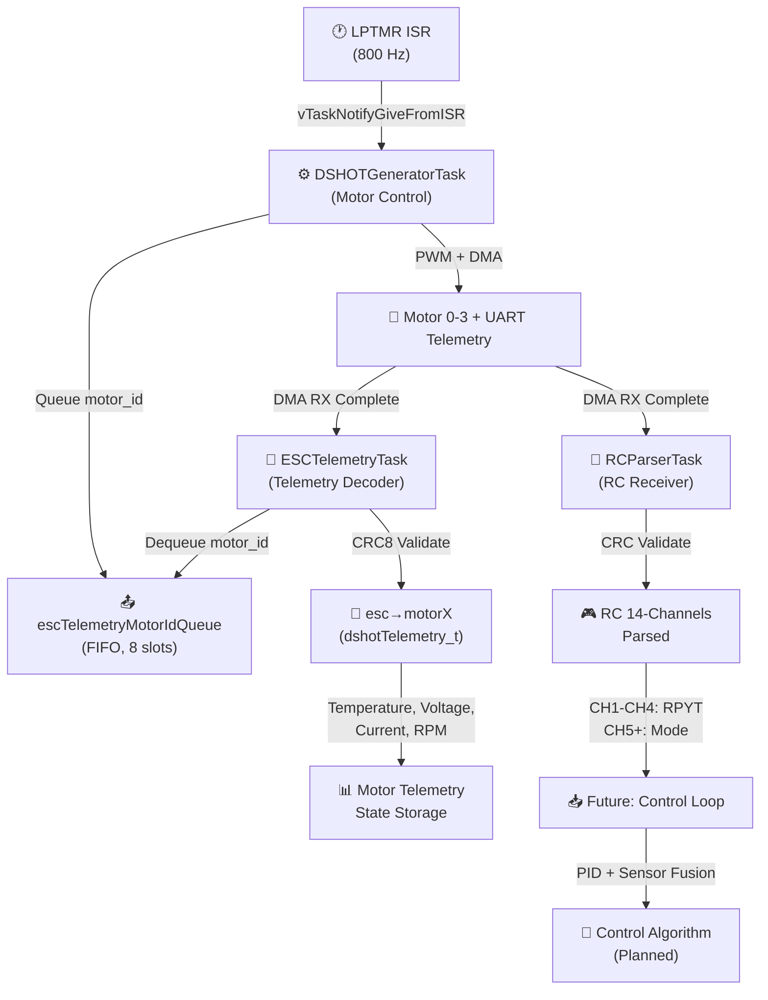
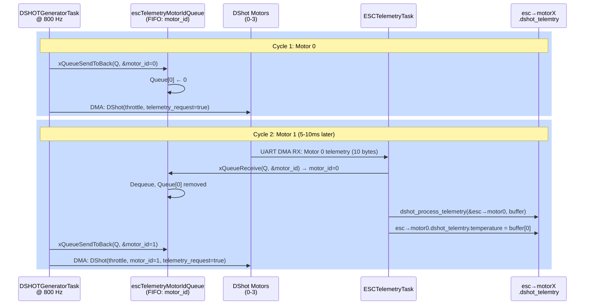
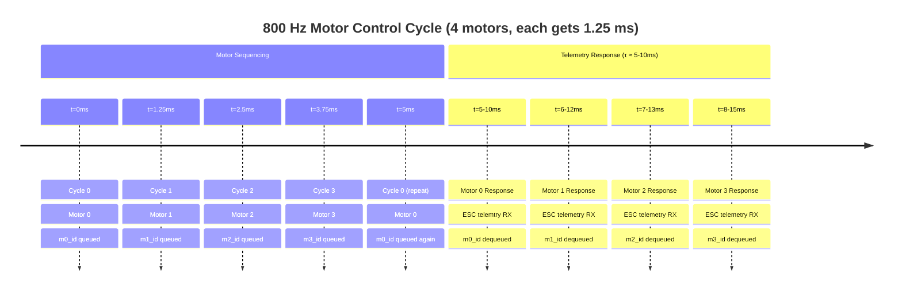
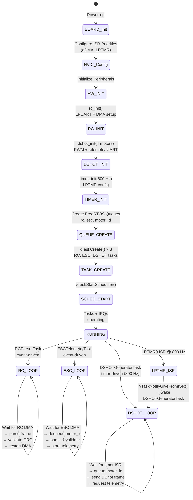
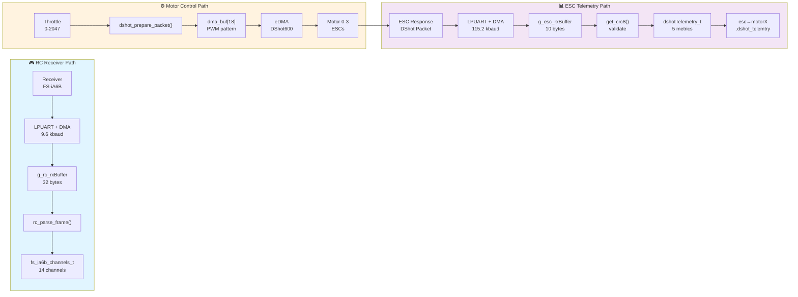

# FreeRTOS-Based Flight Controller for FRDM-MCXn947

## Project Overview

This project implements a **flight controller** for the FRDM-MCXn947 development board using NXP's MCXn947 ARM Cortex-M33 microcontroller. The system uses **FreeRTOS** for real-time task scheduling and provides a complete architecture for autonomous drone flight control, with concurrent handling of radio control input, motor commands, and telemetry feedback.

**Target Hardware:**
- **MCU:** NXP MCXn947 (Cortex-M33, dual-core capable)
- **Development Board:** FRDM-MCXn947
- **Supported Motors:** 4× DShot-capable ESCs with telemetry feedback

---

## Architecture Overview

### System Design

The flight controller is built on a **task-based architecture** using FreeRTOS, with three primary concurrent tasks coordinated by timer-driven interrupts:

```
Timer ISR (800 Hz)
    ├─> DSHOTGeneratorTask (Motor Control)
    └─> signals RC & ESC tasks via DMA completion
         ├─> RCParserTask (Radio Control Input)
         ├─> ESCTelemetryTask (Motor Feedback)
         └─> [Future] SensorFusionTask
              └─> [Future] ControlAlgorithmTask
```

### Task Execution Timeline & Synchronization



### Task Interaction & Data Flow



### Current Implementation: 3 Primary Tasks

#### 1. **RCParserTask** - Radio Control Receiver
- **Purpose:** Parses incoming RC frames from an FS-iA6B receiver
- **Protocol:** UART-based binary protocol (32-byte frames)
- **Key Features:**
  - Non-blocking reception via DMA (LPUART + eDMA)
  - CRC validation for frame integrity
  - ISR-based notification system (DMA completion triggers task)
  - Handles all 14 RC channels from the receiver
  - Automatically resynchronizes on corrupted frames
- **Data:** `fs_ia6b_channels_t` containing 14-channel (CH1-CH14) PWM values (800-2200 µs)
- **Status:** ✅ Fully implemented and tested

#### 2. **DSHOTGeneratorTask** - Motor Control
- **Purpose:** Sends DShot protocol commands to 4 electronic speed controllers (ESCs)
- **Protocol:** DShot600 (600 kbps) via PWM
- **Key Features:**
  - Timed at 800 Hz (every 1.25 ms) via LPTMR interrupt
  - Cycles through motors 0→1→2→3, requesting telemetry from each
  - Throttle ramping with CRC8 packet validation
  - DMA-driven PWM signal generation (maintains MCU in low-power mode)
  - Requests telemetry from one motor per cycle for bandwidth efficiency
- **Motor Structure:** `dshotMotor_t` per motor (16 total fields for control + feedback)
- **Status:** ✅ Fully implemented with telemetry queue integration

#### 3. **ESCTelemetryTask** - Motor Telemetry Decoder
- **Purpose:** Receives and parses telemetry data from ESCs
- **Protocol:** DShot telemetry (10-byte frames at 115.2 kbaud UART)
- **Key Features:**
  - Non-blocking DMA-based UART reception
  - CRC8 validation for frame integrity
  - **Queue-based motor ID tracking:** Knows which motor sent each telemetry frame via `escTelemetryMotorIdQueue`
  - Stores decoded telemetry directly into corresponding `esc->motorX.dshot_telemtry` struct
  - Extracts: temperature (°C), voltage (centivolts), current (centiamps), power consumption (mAh), eRPM
- **Status:** ✅ Fully implemented (queue integration added)

---

## Hardware & Peripheral Mapping

### Communication Interfaces (DMA-Enabled)

| Peripheral | Purpose | Protocol | DMA | Status |
|------------|---------|----------|-----|--------|
| **LPUART** | RC receiver input | Binary protocol @ ~9.6 kbaud | ✅ eDMA | ✅ Active |
| **LPUART** | ESC telemetry | DShot @ 115.2 kbaud | ✅ eDMA | ✅ Active |
| **LPSPI** | IMU sensor (accel/gyro) | SPI/DMA | ❌ TODO | 🚧 Planned |
| **LPSPI** | Barometer (pressure/temp) | SPI/DMA | ❌ TODO | 🚧 Planned |

### Control Interfaces

| Peripheral | Purpose | Frequency | Status |
|------------|---------|-----------|--------|
| **PWM** (eTPU) | DShot motor control (4×) | 600 kHz carrier | ✅ Active |
| **eDMA** | PWM pattern generation | N/A (driven by timer) | ✅ Active |
| **LPTMR** | Task scheduler timer | 800 Hz | ✅ Active |

---

## Data Flow & Queue Architecture

### Motor Telemetry Pairing System

The **escTelemetryMotorIdQueue** ensures telemetry frames are stored in the correct motor struct:



### Queue-based Motor Identification Timing



### Task Synchronization

- **Task notifications** via `vTaskNotifyGiveFromISR()` for low-latency wakeups
- **Queues** for passing data between tasks (RC channels, motor IDs)
- **Global synchronization** through shared `dshotSystem_t esc` pointer

---

## System Control Flow & Initialization



---

## Implemented Features

### ✅ Complete

- [x] RC receiver integration (FS-iA6B, 14-channel IBUS protocol)
- [x] DShot600 motor control with PWM + DMA
- [x] ESC telemetry decoding (10-byte frame, CRC8 validation)
- [x] Motor-specific telemetry storage (queue-based ID tracking)
- [x] Non-blocking DMA-based UART I/O (RC & ESC)
- [x] Timer-driven task scheduling (800 Hz)
- [x] FreeRTOS task management with proper priorities
- [x] Interrupt priority configuration for nested critical sections

### 🚧 In Progress / TODO

#### Phase 2: Sensor Integration
- [ ] **IMU (Inertial Measurement Unit)**
  - LPSPI + DMA for accelerometer & gyroscope & magnetometer
  - 9-DOF measurements (250Hz)
  - Support for common sensors: ICM-20948, GY-BNO085

- [ ] **Barometer**
  - LPSPI + DMA for pressure & temperature sensing
  - Altitude estimation via pressure-to-altitude conversion
  - BME280

#### Phase 3: Sensor Fusion
- [ ] **SensorFusionTask** (new task)
  - Fuse IMU and barometer data
  - Complementary filter or Kalman filter implementation
  - Output: attitude (roll, pitch, yaw), altitude, vertical velocity

#### Phase 4: Control Algorithm
- [ ] **ControlLoopTask ** (new task)
  - **PID control loops:**
    - Attitude stabilization (roll, pitch, yaw rates)
    - Altitude hold 
  - Read RC inputs → fuse sensor data → compute motor commands
  - 400 Hz loop
  - **Failsafe:** descending throttle ramp on signal loss

---

## Data Structures & Protocol Flow

### Data Structure Hierarchy

```mermaid
graph TB
    ROOT["🚁 dshotSystem_t<br/>(Global ESC System)"]
    
    ROOT --> UART["uart_ctrl_t<br/>(Telemetry UART)"]
    ROOT --> M0["dshotMotor_t<br/>Motor 0"]
    ROOT --> M1["dshotMotor_t<br/>Motor 1"]
    ROOT --> M2["dshotMotor_t<br/>Motor 2"]
    ROOT --> M3["dshotMotor_t<br/>Motor 3"]
    
    M0 --> TELEM0["dshotTelemetry_t<br/>(Feedback)"]
    M0 --> CTRL0["dshotControl_t<br/>(Commands)"]
    M0 --> DMA0["dma_ctrl_t<br/>(PWM buffer)"]
    M0 --> PWM0["pwm_ctrl_t<br/>(PWM config)"]
    M0 --> ID0["motor_id: 0"]
    
    M1 --> TELEM1["dshotTelemetry_t"]
    M1 --> CTRL1["dshotControl_t"]
    M1 --> DMA1["dma_ctrl_t"]
    M1 --> PWM1["pwm_ctrl_t"]
    M1 --> ID1["motor_id: 1"]
    
    M2 --> TELEM2["dshotTelemetry_t"]
    M2 --> CTRL2["dshotControl_t"]
    M2 --> DMA2["dma_ctrl_t"]
    M2 --> PWM2["pwm_ctrl_t"]
    M2 --> ID2["motor_id: 2"]
    
    M3 --> TELEM3["dshotTelemetry_t"]
    M3 --> CTRL3["dshotControl_t"]
    M3 --> DMA3["dma_ctrl_t"]
    M3 --> PWM3["pwm_ctrl_t"]
    M3 --> ID3["motor_id: 3"]
    
    TELEM0 --> TEMP["temperature_u8"]
    TELEM0 --> VOLT["voltage_cv_u16"]
    TELEM0 --> AMP["current_ca_u16"]
    TELEM0 --> MAH["consumption_mah_u16"]
    TELEM0 --> RPM["erpm_u16"]
    TELEM0 --> VAL["valid_b"]
    
    CTRL0 --> THROT["throttle_u16"]
    CTRL0 --> TREQ["requestTelemetry_b"]
    
    style ROOT fill:#ff9999
    style M0 fill:#99ccff
    style M1 fill:#99ccff
    style M2 fill:#99ccff
    style M3 fill:#99ccff
    style TELEM0 fill:#99ff99
    style CTRL0 fill:#ffff99
```



### Protocol Communication Layers



## Data Structures

### Motor Control
```c
typedef struct dshotMotor_s {
    dshotTelemetry_t dshot_telemtry;  // Decoded feedback
    dshotControl_t   dshot_control;   // Throttle + telemetry request
    dma_ctrl_t       dma;              // DMA channel config
    pwm_ctrl_t       pwm;              // PWM output config
    uint8_t          motor_id;         // 0-3
} dshotMotor_t;

typedef struct dshotSystem_s {
    uart_ctrl_t      telemetry_uart;   // ESC telemetry UART
    dshotMotor_t     motor0;
    dshotMotor_t     motor1;
    dshotMotor_t     motor2;
    dshotMotor_t     motor3;
} dshotSystem_t;
```

### Radio Control
```c
typedef struct {
    RC_Channel_t CH1;   // Roll (right stick horizontal)
    RC_Channel_t CH2;   // Pitch (right stick vertical)
    RC_Channel_t CH3;   // Throttle (left stick vertical)
    RC_Channel_t CH4;   // Yaw (left stick horizontal)
    RC_Channel_t CH5;   // Mode (switch)
    // ... CH6-CH14 (additional channels)
} fs_ia6b_channels_t;
```

### ESC Telemetry
```c
typedef struct dshotTelemetry_s {
    int8_t temperature_u8;              // Temperature in °C
    uint16_t voltage_cv_u16;            // Voltage (centivolts) = V × 100
    uint16_t current_ca_u16;            // Current (centiamps) = A × 100
    uint16_t consumption_mah_u16;       // Energy consumption (mAh)
    uint16_t erpm_u16;                  // eRPM ÷ 100
    bool valid_b;                       // Last frame valid?
} dshotTelemetry_t;
```

---

## File Organization

```
frdmmcxn947_freertos_drone/
├── main.c                          # Entry point & FreeRTOS task definitions
├── dshot.c/.h                      # DShot motor control & telemetry decoder
├── rc_fsia6B.c/.h                  # FS-iA6B RC receiver parser
├── uart_driver_mcxn947.c/.h        # LPUART + DMA abstraction layer
├── pwm_driver_mcxn947.c/.h         # PWM/eTPU control
├── dma_driver_mcxn947.c/.h         # eDMA channel management
├── timer_driver_mcxn947.c/.h       # LPTMR task scheduling
│
├── CMakeLists.txt                  # Build configuration (ZEPHYR/NXP SDK)
├── CMakePresets.json               # Build presets (debug, release)
├── prj.conf                        # Zephyr kernel config
├── Kconfig                         # Config options
│
├── frdmmcxn947_cm33_core0/          # Board-specific configs
└── debug/                           # Build artifacts & CMake cache
```

---

## Prerequisites
- **NXP MCUXpresso IDE** v12.0+ or **VS Code** with CMake extension
- **FreeRTOS** kernel (included via MCUX SDK)
- **MCUXpresso SDK** for MCXN947
- **Zephyr RTOS** build system (configured in CMakeLists.txt)

---

## Performance Characteristics

### Task Scheduling
- **Timer Frequency:** 800 Hz (1.25 ms period)
- **Motor Control Rate:** 800 Hz (4 motors × 200 Hz effective per motor)
- **RC Parser Rate:** Event-driven (on DMA completion, typically 50-100 Hz)
- **ESC Telemetry Rate:** Event-driven (on DMA completion, ~200 Hz total)

### Latency
- **RC → Motor Command:** < 3 ms (next timer tick)
- **Motor Telemetry → Available:** 1ms (ESC response time)
- **ISR to Task Switch:** < 100 µs (FreeRTOS)

---

## Next Steps

### Immediate (Sensor Integration)
1. Design LPSPI driver for IMU/barometer (DMA-enabled)
2. Implement sensor initialization & data reading
3. Create interrupt/notification handlers for fast sampling

### Short-term (Sensor Fusion)
1. Choose fusion algorithm (complementary filter or EKF)
2. Implement SensorFusionTask (runs at 100-200 Hz)
3. Output attitude (roll, pitch, yaw) and altitude

### Medium-term (Control Loop)
1. Implement PID controller for attitude stabilization
   - Inner loop: gyro rate control (1000+ Hz possible)
   - Outer loop: attitude from accelerometer/complementary filter (200 Hz)
2. Create ControlAlgorithmTask with priority above sensors
3. Add safety checks (failsafe, throttle limits)

### Long-term (Advanced)
- [ ] Adaptive control (gain scheduling)
- [ ] Advanced filtering (Kalman filter)
- [ ] Multi-rate control (fast gyro, slow altitude)
- [ ] Wireless telemetry feedback to ground station
- [ ] Autonomous flight modes (hold altitude, GPS waypoints)

---

## References & Standards

- **DShot Protocol:** [Betaflight Dshot Spec](https://betaflight.com/docs/development/API/Dshot)
- **FS-iA6B Receiver:** FlySky iBus protocol
- **FreeRTOS:** [Kernel documentation](https://www.freertos.org/)
- **NXP MCXN947:** [Reference Manual](https://www.nxp.com/design/design-center/development-boards-and-designs/FRDM-MCXN947)
- **eDMA:** Enhanced Direct Memory Access for real-time I/O

---

## Author & License

**Author:** Diego  
**Created:** April 2026  
**Development Status:** Alpha (flight-critical systems pending)

---

## Safety & Disclaimer

⚠️ **WARNING:** This flight controller is under active development. **Do NOT use on actual aircraft without thorough testing and failsafe verification.** Ensure proper:
- PWM signal integrity (scope-verified)
- ESC response verification
- RC link failsafe behavior
- Motor rotation direction testing (on bench, without props)
- Emergency stop/disarm procedures

---
