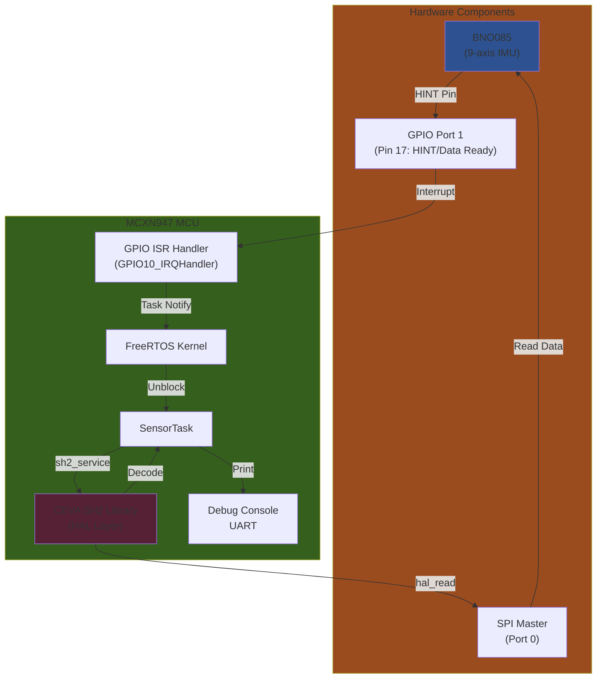
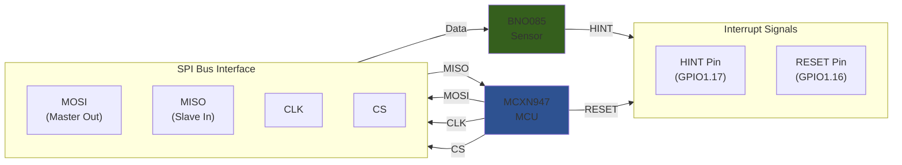
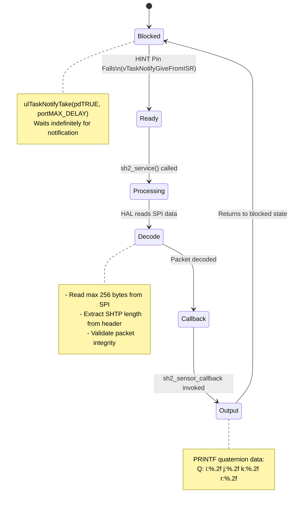

# BNO085 IMU Driver for FRDM-MCXN947

A FreeRTOS-based driver for the Bosch BNO085 9-axis IMU sensor on the NXP FRDM-MCXN947 microcontroller. This implementation uses the CEVA SH2 library for sensor data processing and achieves 100Hz (10ms) interrupt-driven data updates.

## Table of Contents
- [System Overview](#system-overview)
- [Hardware Architecture](#hardware-architecture)
- [Data Flow](#data-flow)
- [Software Architecture](#software-architecture)
- [Building the Project](#building-the-project)
- [Running the Application](#running-the-application)
- [Key Features](#key-features)
- [Known Issues & Troubleshooting](#known-issues--troubleshooting)

---

## System Overview

The BNO085 is a sophisticated 9-axis sensor (accelerometer, gyroscope, magnetometer) with onboard sensor fusion. This project integrates it with the MCXN947 using:

- **Real-time OS**: FreeRTOS for task scheduling and synchronization
- **Communication**: SPI master protocol (3-wire with CS/MOSI/MISO/CLK)
- **Interrupts**: GPIO HINT pin (falling edge) signals data ready
- **Sensor Library**: CEVA SH2 library for SHTP protocol and sensor decoding
- **Update Rate**: 100 Hz (10ms intervals)

### System Architecture



---

## Hardware Architecture

### Pin Configuration

| Component | Port | Pin | Direction | Function |
|-----------|------|-----|-----------|----------|
| **SPI MASTER** | SPI0 | - | - | Clock & Data |
| **HINT** | GPIO1 | 17 | Input | Data Ready Interrupt |
| **RESET** | GPIO1 | 16 | Output | Sensor Reset |
| **Debug UART** | UART0 | - | Output | Serial Console |

### Block Diagram



---

## Data Flow

### Interrupt-Driven Update Sequence

The following sequence diagram shows the complete 100Hz update cycle triggered by the BNO085 HINT pin:

```mermaid
sequenceDiagram
    participant BNO as BNO085 (Hardware)
    participant ISR as GPIO ISR<br/>Handler
    participant Kernel as FreeRTOS<br/>Kernel
    participant Task as SensorTask
    participant CEVA as CEVA sh2_lib
    participant SPI as SPI Master
    participant Console as Serial Console

    Note over BNO, Console: 100Hz Update Cycle (Every 10ms)
    
    rect rgb(46, 82, 145)
    Note over BNO: Data Ready
    BNO->>ISR: HINT Pin Falls LOW
    end
    
    rect rgb(53, 95, 29)
    activate ISR
    Note over ISR: ISR Context
    ISR->>ISR: gpio_clear_interrupt_flag()
    ISR->>Kernel: vTaskNotifyGiveFromISR()
    ISR->>ISR: portYIELD_FROM_ISR
    deactivate ISR
    end
    
    rect rgb(154, 76, 31)
    Note over Task: Task Wakes Up
    activate Task
    Task->>Task: ulTaskNotifyTake(pdTRUE, PORT_MAX_DELAY)
    Note over Task: Blocked → Ready
    end
    
    rect rgb(50, 103, 69)
    activate CEVA
    Note over CEVA: Process Sensor Data
    Task->>CEVA: sh2_service()
    
    CEVA->>SPI: hal_read(buffer, 256)
    activate SPI
    SPI->>BNO: Assert CS, Clock 256 bytes
    BNO-->>SPI: SHTP Packet Response
    SPI-->>CEVA: Returns actual packet length
    deactivate SPI
    
    Note over CEVA: Parse SHTP Header<br/>(Extract length & channel)
    CEVA->>CEVA: Validate & Decode Packet
    
    Note over CEVA: Quaternion Data Found
    CEVA->>Task: sh2_sensor_callback(sensorValue)
    deactivate CEVA
    end
    
    rect rgb(87, 33, 53)
    Note over Task: Output Data
    activate Task
    Task->>Console: PRINTF("Q: i:%.2f j:%.2f k:%.2f r:%.2f")
    deactivate Task
    end
    
    rect rgb(71, 46, 115)
    Note over Task: Wait for Next Interrupt
    Task->>Task: Block on ulTaskNotifyTake()
    deactivate Task
    end
```



### State Diagram - SensorTask Lifecycle



---

## Software Architecture

### Directory Structure

```
frdmmcxn947_freertos_imu/
├── main.c                           # Application entry point
├── sensors/
│   └── bno_08x/
│       ├── bno_08x.c               # BNO085 driver implementation
│       └── bno_08x.h               # BNO085 driver header
├── mcxn_drivers/
│   ├── gpio_driver_mcxn947.c       # GPIO driver (ISR handling)
│   ├── gpio_driver_mcxn947.h       # GPIO driver header
│   ├── spi_driver_mcxn947.c        # SPI master driver
│   └── spi_driver_mcxn947.h        # SPI driver header
├── CMakeLists.txt                   # Build configuration
├── CMakePresets.json                # CMake presets
└── README.md                        # This file
```

### Module Responsibilities

| Module | Responsibility |
|--------|-----------------|
| **main.c** | FreeRTOS kernel initialization, task creation, IMU callback setup |
| **bno_08x.c** | BNO085-specific initialization, SH2 HAL bridge implementation |
| **gpio_driver_mcxn947.c** | GPIO configuration, ISR handlers, interrupt flag management |
| **spi_driver_mcxn947.c** | SPI master initialization, blocking/DMA transfers |

### Key Components

#### 1. **IMU_Update_Callback** (main.c)
Triggered by GPIO ISR when BNO085 HINT pin falls:
```c
void IMU_Update_Callback(void) {
    gpio_clear_interrupt_flag(imu.gpio_event.gpio_base, imu.gpio_event.pin);
    vTaskNotifyGiveFromISR(sensorTaskHandle, &xHigherPriorityTaskWoken);
    portYIELD_FROM_ISR(xHigherPriorityTaskWoken);
}
```

#### 2. **SensorTask** (main.c)
Main sensor processing loop:
```c
static void SensorTask(void *pvParameters) {
    for (;;) {
        ulTaskNotifyTake(pdTRUE, portMAX_DELAY);  // Block until notified
        sh2_service();                             // Process sensor data
    }
}
```

#### 3. **HAL Layer** (bno_08x.c - CEVA Library Bridge)
- `hal_open()` / `hal_close()`: Session management
- `hal_read()`: Reads SPI data (only when HINT is low)
- `hal_write()`: Sends SPI commands
- `hal_getTimeUs()`: Provides timestamp for sensor fusion

#### 4. **GPIO ISR Handler** (gpio_driver_mcxn947.c)
Invokes registered callback for falling edge interrupts:
```c
void GPIO11_IRQHandler(void) {
    if (GPIO11_HANDLER != NULL) {
        (*GPIO11_HANDLER)();
    }
}
```

---

## Building the Project

### Prerequisites
- NXP MCUXpresso development environment or CMake with Ninja
- ARM GCC toolchain
- FreeRTOS kernel source
- CEVA SH2 library source
- NXP MCUXsdk installed

### Build Steps

#### Using CMake (Recommended)

```bash
# Navigate to project root
cd frdmmcxn947_freertos_imu

# Configure (creates debug/ build folder)
cmake --preset debug

# Build all targets
cmake --build ./debug --config Debug
```

#### Using VS Code Tasks

1. Press `Ctrl+Shift+B` to open the build task
2. Select "CMake: build"
3. Build will complete and generate `freertos_hello_cm33_core0.elf`

### Build Output
- **Executable**: `debug/freertos_hello_cm33_core0.elf`
- **Map File**: Contains symbol information for debugging
- **Compile Commands**: `debug/compile_commands.json` for IDE integration

---

## Running the Application

### 1. Flash to Device
```bash
# Using J-Link (configured in debug settings)
# Connect FRDM-MCXN947 via USB

# Option A: Via VS Code Debug
- Press F5 or click "Run and Debug"
- Select "SEGGER: Debug" configuration

# Option B: Manual command-line
jlink -CommanderScript JLink_freertos_hello_cm33_core0.jlink
```

### 2. Monitor Output
```bash
# Open serial terminal at 115200 baud
# Linux/Mac:
screen /dev/ttyUSB0 115200

# Windows:
# Use PuTTY or VS Code terminal at COM port
```

### 3. Expected Output
```
Q: i:0.05 j:-0.12 k:0.85 r:0.51
Q: i:0.04 j:-0.11 k:0.86 r:0.50
Q: i:0.06 j:-0.13 k:0.84 r:0.52
...
(Updates at 100 Hz - lines appear ~100 times per second)
```

---

## Key Features

### ✅ Implemented Features

1. **100Hz Update Rate**: Interrupt-driven, synchronized with BNO085 HINT pin
2. **FreeRTOS Integration**: Task notification mechanism for efficient synchronization
3. **SPI Communication**: Full-duplex SPI master with optional DMA support
4. **Quaternion Output**: Real-time 9-axis sensor fusion via CEVA SH2 library
5. **GPIO Interrupt Handling**: Falling-edge detection with callback mechanism
6. **Serial Debug Output**: UART console for quaternion visualization
7. **Hardware Reset Control**: GPIO output for BNO085 hardware reset

### 📊 Performance Characteristics

| Metric | Value |
|--------|-------|
| Update Frequency | 100 Hz |
| Interrupt Latency | <1 ms |
| SPI Baudrate | 1 MHz (configurable) |
| Task Stack | ~100 bytes + minimal overhead |
| Memory Footprint | ~2 KB RAM (task stack + buffers) |

---

## Known Issues & Troubleshooting


---

## Configuration Reference

### Sensor Configuration (bno_08x.c)

```c
// Quaternion output at 100Hz (10ms intervals)
sh2_SensorConfig_t config = {0};
config.reportInterval_us = 10000;  // 10ms = 100Hz
sh2_setSensorConfig(SH2_ROTATION_VECTOR, &config);
```

### GPIO Configuration

| GPIO | Port | Pin | Function | Interrupt Config |
|------|------|-----|----------|------------------|
| HINT | GPIO1 | 17 | Data Ready | Falling Edge |
| RESET | GPIO1 | 16 | Reset Control | Output Only |

### SPI Configuration (mcxn_drivers/)

| Parameter | Value | Notes |
|-----------|-------|-------|
| Clock | 1 MHz | Configurable in `spi_get_defaultconfig_imu()` |
| Mode | SPI Mode 0 | CPOL=0, CPHA=0 |
| Data Width | 8-bit | Standard SPI frame |
| DMA Support | Optional | Enabled by default in config |

---

## References

- **BNO085 Datasheet**: https://www.bosch-sensortec.com/products/sensor-hubs/bnx055-smart-sensor-hub/
- **SHTP Protocol**: BNO085 Technical Reference Manual
- **CEVA SH2 Library**: Included in MCUXsdk
- **MCXN947 Reference Manual**: https://www.nxp.com/products/microcontrollers-microprocessors/mcx/mcx-arm-cortex-m/mcxn947
- **FreeRTOS Documentation**: https://www.freertos.org/

---

## License

This project is part of the DRONE project. Check individual driver files for specific license information.

---

## Author

Diego - DRONE Project Team (April 2026)

